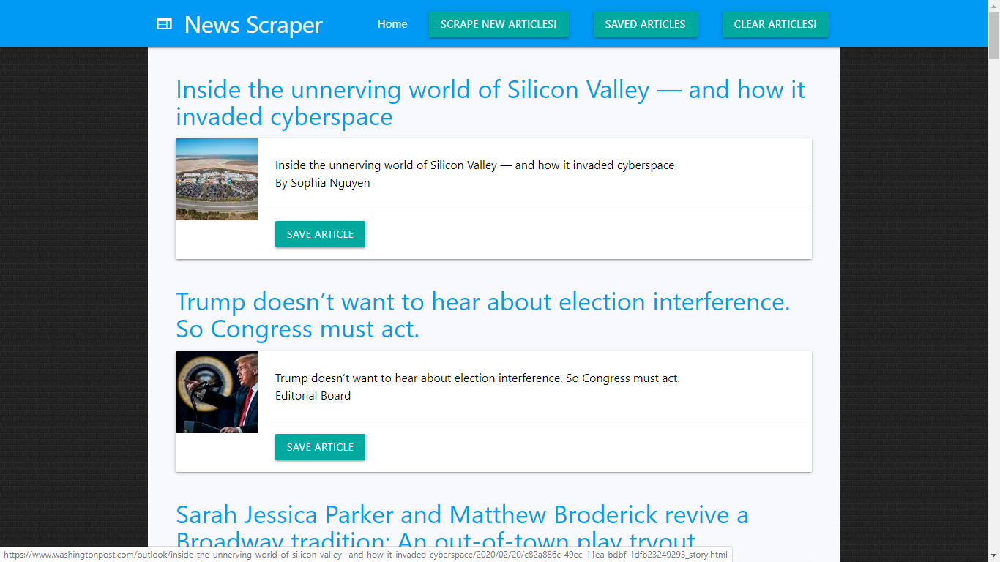

# News-Scraper

### File

* [`News Scraper`](server.js)

### Technologies
MySQL, Node, Express, Handlebars, MongoDB. It follows a MVC design pattern; Node and MongoDB to query and route data in the app, and Handlebars to generate the HTML.

NPM packages used:
   1. express

   2. express-handlebars

   3. mongoose

   4. cheerio

   5. axios

CSS Framework - Materialize   

### Description
News Scraper! a web app that lets users view and leave comments on the latest news.

* Link: 
     * Site Link: https://young-lowlands-17486.herokuapp.com/
     * Github Link: https://github.com/shruti-gaonkar/News-Scrape

      

* News Scraper! a web app that lets users view and leave comments on the latest news.

* Whenever a user visits the site, the app scrape stories from Washington Post and display them for the user. The app scrapes and displays the following information for each article:

     * Headline - the title of the article

     * Summary - a short summary of the article

     * URL - the url to the original article

     * Image - the image if it exists for the post

     * Byline - author of each post if it exists

* Each scraped article has a Save button to save it to the application database.     

* Users are able to leave comments on the articles displayed using modals and can revisit them later. The comments are saved to the database as well and associated with their articles. 

* Users are able to delete comments left on articles. 

* All stored comments are visible to every user.
